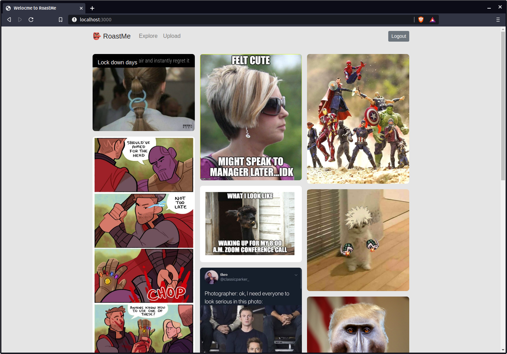

# 👺 RoastMe

RoastMe is a simple meme sharing platform, built using React, Express.js, and MySQL. This project was inteded to help me apply what I had learned throught the React docs, and tutorials on Udemy.

<p align="center">
    
    <small><i>Homepage with a logged in user</i></small>
</p>

<br />

## Set up
Since this repo is only for the front end part of the project, in order to properly run the project, it is necessary to set up the API server, [RoastMe API](https://github.com/ayaanqui/roastme-api) (Follow the instructions on the API repo page).

Once the server is set up correctly and is running, we can then proceed to work on setting up the React frontend.

```
git clone https://github.com/ayaanqui/roastme-frontend.git
cd roastme-frontend
```

Now, we will proceed to install all the necessary dependencies:
```
npm install
```
And finally, we can run the frontend server
```
npm start
```